# Data infrastructure engineer challenge

## Proposed solution: Utilize kinesis data streams and firehose to deliver the data

The architecture proposed consists of the following mayor components

- An API Gateway that will serve as reverse proxy to the kinesis streams
- Two kinesis streams, one for user_events, user_utm, but new pipelines can be added easily with few lines in the code)
- Two kinesis firehose streams to deliver data to buckets in a different account, this can be expanded easily with few lines of code as well
- Two s3 buckets that will store all the data to be loaded into redshift, this allows to reload the data in the future as necessary
- Four AWS glue crawlers (two S3 crawlers and two Redshift crawlers) that will
  - For S3 analyze and discover the structure of the data in each bucket and produce a table with the schema discovered
  - For Redshift to discovered the schema of the tables in the redshift database and produce a table with the schema discovered
- Four glue databases and tables that will contain the schema that will be utilized to match both schema of the data in S3 and schema of the tables in redshift
- A VPC endpoint for redshift to allow the glue ETL job to access the redshift instance
- Several IAM roles and policies

### Components that need to be created manually

- An IAM role that will allow engineering account assume a role in the data-platform to create infrastructure
- AWS Glue Job to perform the ETL of the data from S3 to the Redshift tables (I'll provide the steps to create this here, I did not automate this with terraform due to time constraints)
- I'm assuming you already have a redshift database, if not, please create one and don't forget the credentials
- Configurations specific to your AWS accounts, but this is in no way avoidable

## Components from the diagram that are not implemented

- The firehose that forwards data to the raw data bucket, this is only an optional proposal aditional firehose that could be implemented in case at some point some transformation is necessary to the "Transformed Data" bucket is necessary, having the raw bucket would allow to re-process the data at a later point of time untransformed to process it differently, this section is optional and could be implemented based on the circunstances
- The Quicksight component

## Architecture diagram

Since I'm working alone and don't have a team to get feedback and input from, I'm assuming that the initial solution doesn't require to have real time or near real time analisys of the data streams, but the architecture can be extended giving the possibility to do so. Also I see that this is not the only way to solve this problem, other possible architectures would be have a SQS queue where to deliver the data, same API GW as reverse proxy to the SQS and many possible compute solutions that could be used, such as lambdas or EC2 instances with clients subscribed to the queue, I would be happy to discuss more about this ideas with the team.

The implementation as it is today, doesn't scale with the traffic, but is possible to do so, by implementing the solution proposed by AWS here https://aws.amazon.com/blogs/big-data/scaling-amazon-kinesis-data-streams-with-aws-application-auto-scaling/ this would obviously take more time to develop, but the solution is able to scale once this is implemented

This architecture doesn't provide real time data, it has a delay of about 5 to 10 minutes to deliver the data to redshift, this is because the firehose is got a 5 minute schedule to execute and the same schedule is applied to the glue ETL job process, it doesn't provide real time data analytics or events, but it leaves the possibility open to have real time or near real time analysis, that could be achieved by extending the pipelipe by forwarding data from the kinesis streams to kinesis analytics components and thus being able to perform SQL queries on moving windows on time to generate events based on the continuos stream of data on the kinesis streams.

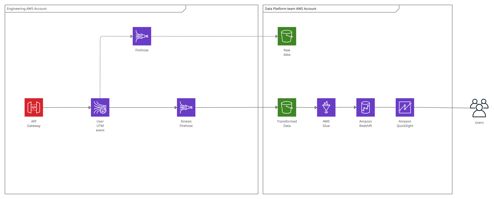

## Things I would improve in this code with more time

Due to time I skipped some configurations or left some permission levels too wide, also some room for improvements is possible in a real scenario, all of them are listed below

- A possible improvement, the API gateway can be configured to have a custom domain
- I'm not configuring a terraform statefile backend, but in a real environment I
  - Utilize terragrunt to keep the backend configuration DRY
  - Use atlantis (https://www.runatlantis.io/) to have a single centralized place to see the diff of the infrastructure to apply before applying it, this allows the team to discuss about changes before applying them, and things would not run on someones laptop
- API Gateway permissions are to wide, should pin point specifically the streams that need to be exposed
- Permissions in the cross account assume role are to wide, should be reduced to only the actions that the engineering account will be allowed to perform on the data platform account

## Configuring and using this repository

You will find that each module or directory with terraform code as a unit will have a README file that describes what variables are available for that module, what types the variables are, if they are required or not an in the casees where the name is not obvious you will find a description as well.

### 1. Create cross account IAM Role

This step needs to be performed manually, and are the steps that will allow the engineering account to assume a role on the data platform account to create S3 buckets

1. In the data platform account in the web console go to IAM and select create a new Role
1. From the options select `Another AWS Account` and in the account ID paste the ID of the account engineering, the id value of the account can be found under the support section in the console
1. Select `Next: Permissions`
1. Search and attach the policies to the role
   - `AmazonS3FullAccess`
   - `AmazonRedshiftFullAccess`
   - `IAMFullAccess`
   - `AWSGlueConsoleFullAccess`
   - `AmazonVPCFullAccess`
1. Select `Next: Tags`
1. Add tags if you want to and select `Next: Review`
1. Define a name and optionally a description
1. Select `Create role`
1. After creating the role, copy the ARN of the role just created (will refer to it as `cross-account-role` from here on)

### Create schema and tables in redshift

I'm assuming you already have a redshift database on the data platform account, if not, please create one that spawns in the vpc you need it to be

1. In the query editor create the schema and tables with the queries below

```sql
CREATE SCHEMA IF NOT EXISTS tracking authorization awsuser;
```

```sql
CREATE TABLE IF NOT EXISTS tracking.events
(
	request_id CHAR(36) NOT NULL
	,request_timestamp TIMESTAMP WITHOUT TIME ZONE NOT NULL
	,cookie_id CHAR(36) NOT NULL
	,topic VARCHAR(1024) NOT NULL
	,message VARCHAR(3128)
	,environment VARCHAR(30)
	,website_id CHAR(36)
	,user_account_id CHAR(36)
	,"location" VARCHAR(5000)
	,user_agent VARCHAR(1024)
	,referrer VARCHAR(500)
)
```

```sql
CREATE TABLE IF NOT EXISTS tracking.utm
(
	request_id VARCHAR(56) NOT NULL  ENCODE zstd
	,source VARCHAR(255) NOT NULL  ENCODE zstd
	,medium VARCHAR(255) NOT NULL  ENCODE zstd
	,campaign VARCHAR(255)   ENCODE zstd
	,content VARCHAR(255)   ENCODE zstd
	,term VARCHAR(255)   ENCODE zstd
	,matchtype VARCHAR(255)   ENCODE zstd
	,"network" VARCHAR(255)   ENCODE zstd
	,ad_id VARCHAR(255)   ENCODE zstd
	,ad_pos VARCHAR(255)   ENCODE zstd
	,placement VARCHAR(255)   ENCODE zstd
	,placement_category VARCHAR(255)   ENCODE zstd
	,testgroup VARCHAR(255)   ENCODE zstd
	,device VARCHAR(255)   ENCODE zstd
)
```

### 2. Creating the engineering side of the pipeline

You can configure this project with variables to adapt it to run in your infrastructure, the project is separated in two directories, one per account

- engineering (Account where the pipelines will be created)
- data-platform (Account where all the data will be stored that includes buckets and redshift as well as the glue ETL crawlers and jobs)

Both modules contain a terraform.tfvars.sample that you can use to create a `terraform.tfvars` file these files already contain the variables that are expected for the module to work in your accounts(in a real centralized CD pipeline environment this values would be environment variables prefixed by `TF_VAR_` or the pipeline process would have to generate and write this file before applying)

1. The first module to apply is engineering, so move into that directory
1. Create a copy of the file called `terraform.tfvars.sample` to a file called `terraform.tfvars`
1. Fill the values with the values for your case
1. Run `terraform init && terraform apply`

This will create of the pipeline components on the side of the engineering account and the buckets on the data platform account

### 3. Creating the data-platform side of the pipeline

1. Move into the data-platform directory and create a copy of `terraform.tfvars.sample` named `terraform.tfvars` fill it with the values that better suit your scenario, if you have any doubt on what is each variable, check the README.md at the root of the `data-platform` directory it explains what each value should be
2. Run `terraform init && terraform apply` it will create all the components on the data platform account side of the pipeline

### Send data to the stream

At this point you can already deliver data to the buckets on the data platform account

- The url will be the output of the module engineering, something similar to `"https://fus2ldjnz7.execute-api.eu-central-1.amazonaws.com/prod/streams/{stream-name}/record"` if you missed that from the output you can run `terraform output` in the engineering directory

- Replace the section {stream-name} with the name of the stream `user-events` or `user-utm` or whatever stream you have created

- Generate a UUID to use as partition key

- Send a PUT request using postman or curl to the endpoint

Samples:

For the user-events pipeline

```bash
curl --location --request PUT 'https://oymkc9uq5j.execute-api.eu-central-1.amazonaws.com/prod/streams/user-events/record' \
--header 'Content-Type: application/json' \
--data-raw '{
	"Data": {"request_id": "fc417c2b-fe7a-4737-afe2-bec49c0ebd6f",
  "request_timestamp": "2020-06-01 00:00:24.000000",
  "cookie_id": "a09c4ca3-d142-4312-ba78-029c3355b8ef",
  "topic": "dolphin_cms.wizard.step.color_palette.set",
  "message": "{\"isAffiliate\":false,\"language\":\"es\",\"isRecommendedPalette\":true,\"color\":\"#6d8d79\",\"paletteIndex\":\"0\",\"workspaceId\":\"ecaca5cd-e23c-4f6d-8ec9-ad8695b378d5\"}",
  "environment": "dolphin_cms",
  "website_id": null,"user_account_id": "0f36f200-df29-4fbf-8625-39a88b7f778c",
  "location": "https://cms.data.com/wizard/color-palette/",
  "user_agent": "Mozilla/5.0 (Windows NT 10.0; Win64; x64; rv:76.0) Gecko/20100101 Firefox/76.0", "referrer": "https://register.data.com/es/product"},
	"PartitionKey": "92ebe247-77f5-4a3c-a7f1-d22af67bf71d"
}'
```

For the user-utm pipeline

```bash
curl --location --request PUT 'https://oymkc9uq5j.execute-api.eu-central-1.amazonaws.com/prod/streams/user-utm/record' \
--header 'Content-Type: application/json' \
--data-raw '{
	"Data": {
    "request_id": "cbae8544-ab7a-46a5-9253-a5c8f6612115",
    "source": "adwords",
    "medium": "cpc",
    "campaign": "Campaign Brand FR",
    "content": null,
    "term": "data",
    "matchtype": "e",
    "network": "g",
    "ad_id": "12063526619",
    "ad_pos": "1t1",
    "placement": null,
    "placement_category": null,
    "testgroup": null,
    "device": "c"
  },
	"PartitionKey": "92ebe247-77f5-4a3c-a7f1-d22af67bf71d"
}'
```

### Run the crawler

Give the data some time to arrive to the s3 buckets on the data platform account, once you see files delivered go to the glue service in the web console and rull all 4 crawlers created, there should be

- 2 s3 crawlers, one for user-events one for user-utm
- 2 redshift crawlers, one for user-events one for user-utm

This process will create tables with the schemas it recognized from both sources

### Create the jobs

I did not automated this part with terraform, but is possible to do, the next are the steps to create the job manually

1. Go to the Gluge service on aws console
2. Under ETL select Jobs
3. Create a new Job

And select the configurations as showed in the images below

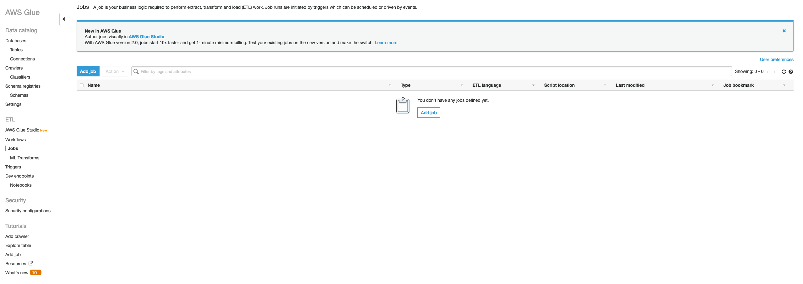

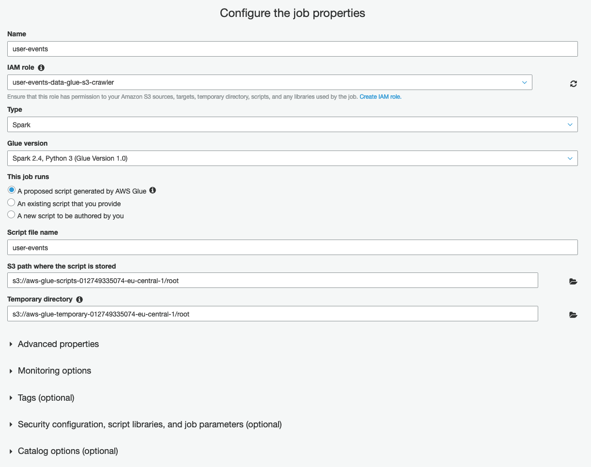

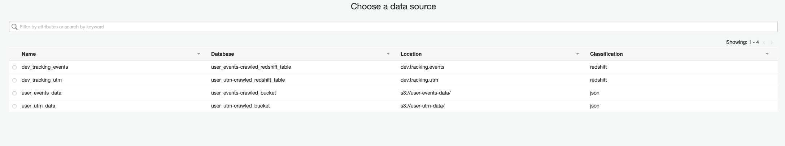

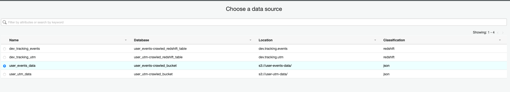

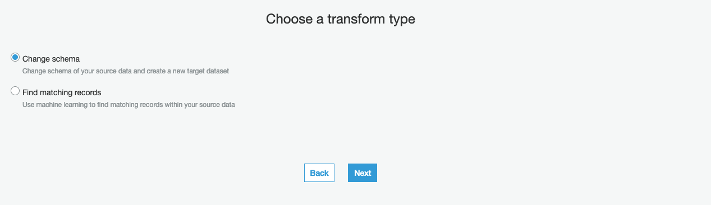

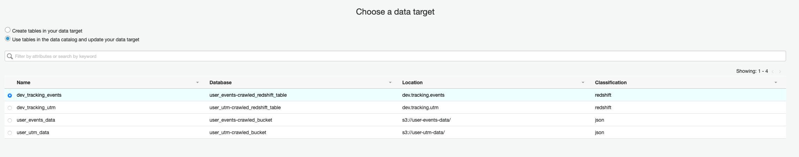

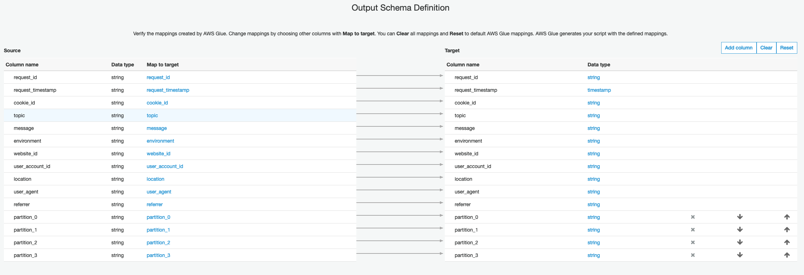

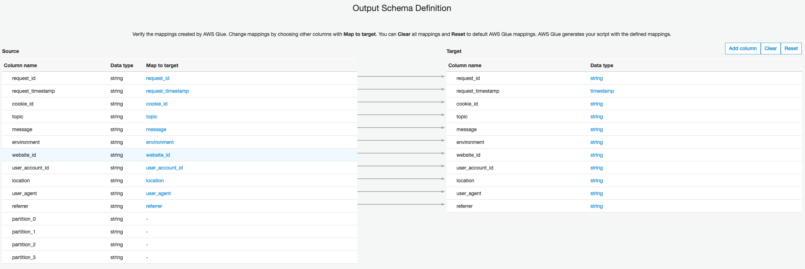

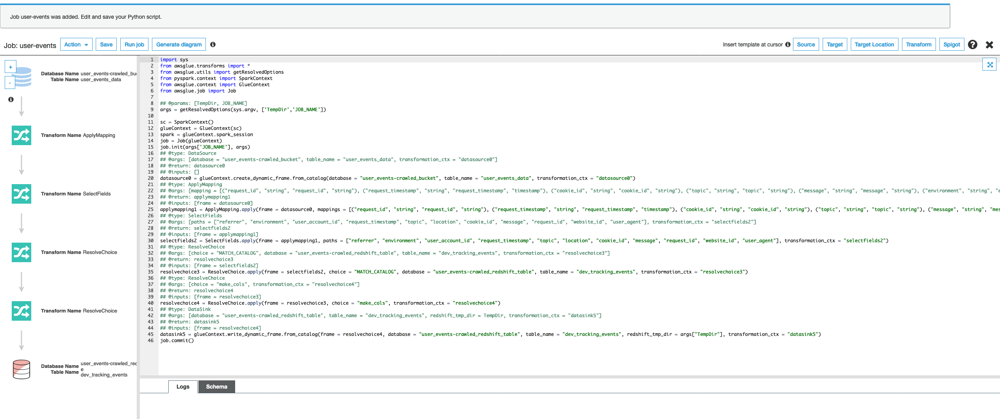

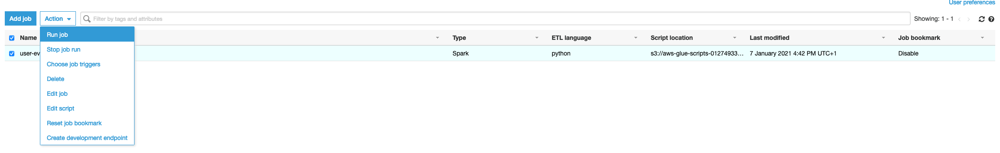

4. Run the job and wait for it to complete

5. Query the database table as shown below, the data should be loaded in the database, this job should be configured to run in timeframes as necessary for the pipeline by creating job triggers, the minimum is 5 minutes.

   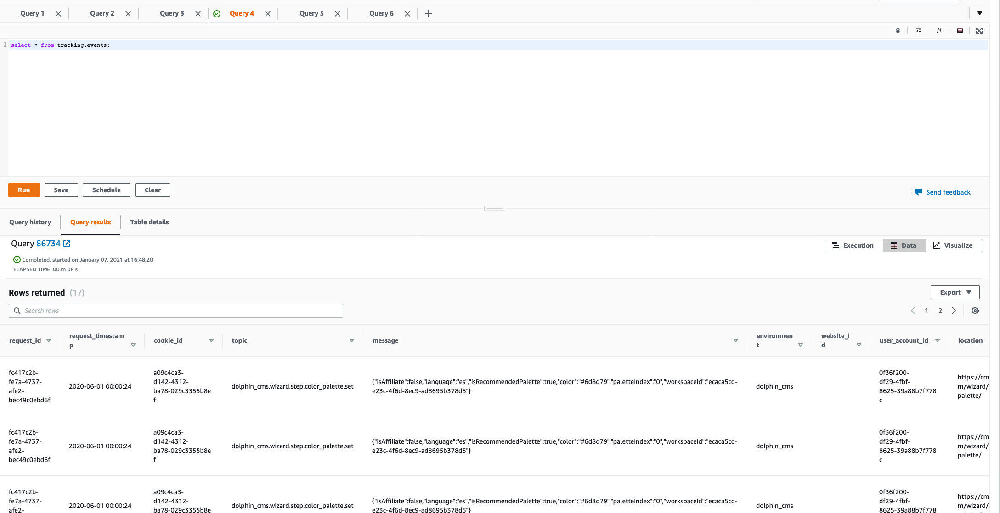

The same process can be repeated for the user-utm pipeline, PUT sent through the API would now end in the database in about 5 to 10 mins

### Costs of runing this infrastructure

I made an effort to estimate of how much would cost to run this infrastructure (Disclaimer, I'm not fully familiarized with the cost estimations of AWS glue, so that part of the estimation could be incorrect)

https://calculator.aws/#/estimate?id=5067a36dd7a8096f6aa1b9c8d1b78a50c79fd195

## Notes

> I utilized a script to estimate the size of the payload sent by outside applications, it is under the scripts directory, it can be reutilized for any payload

> The credentias for the engineering account should be under `~/.aws/data/engineering`

> I'll keep the infrastructure running for one more week in case the team wants to see it running on my side
